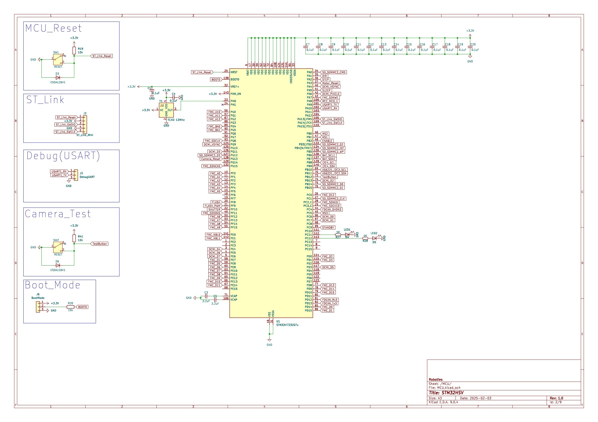
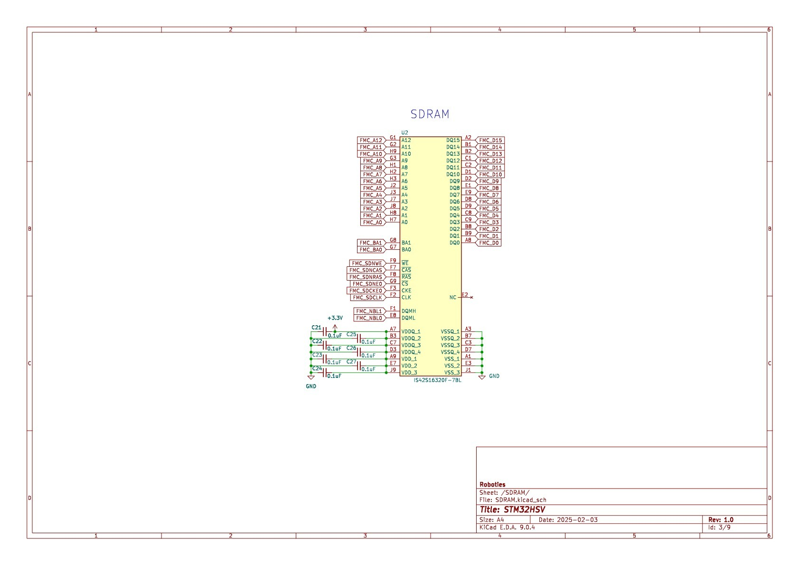
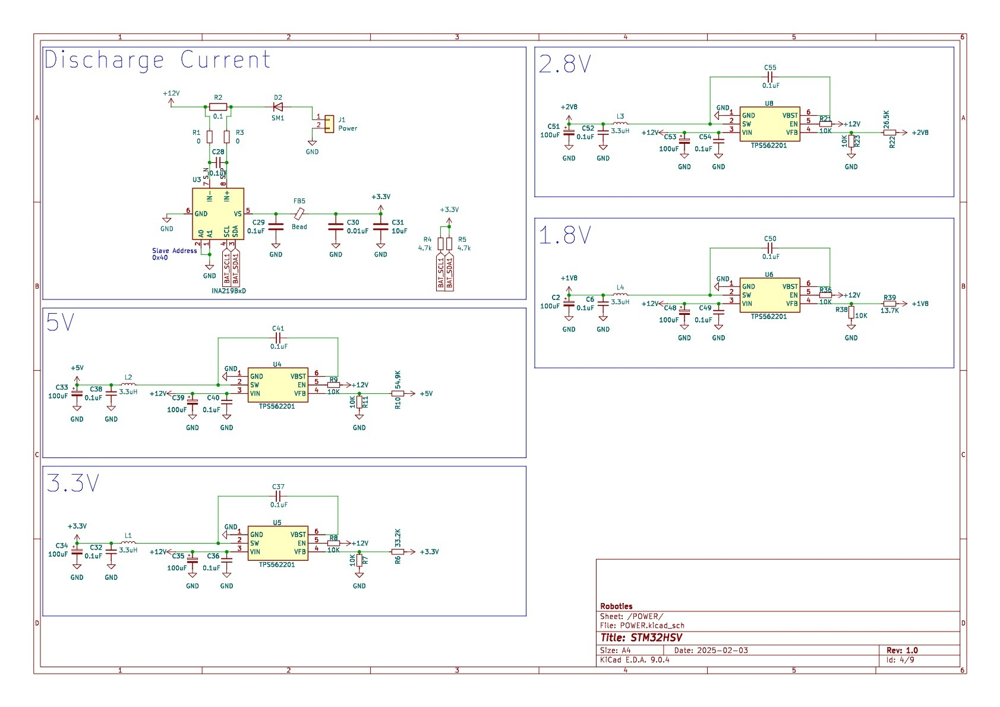
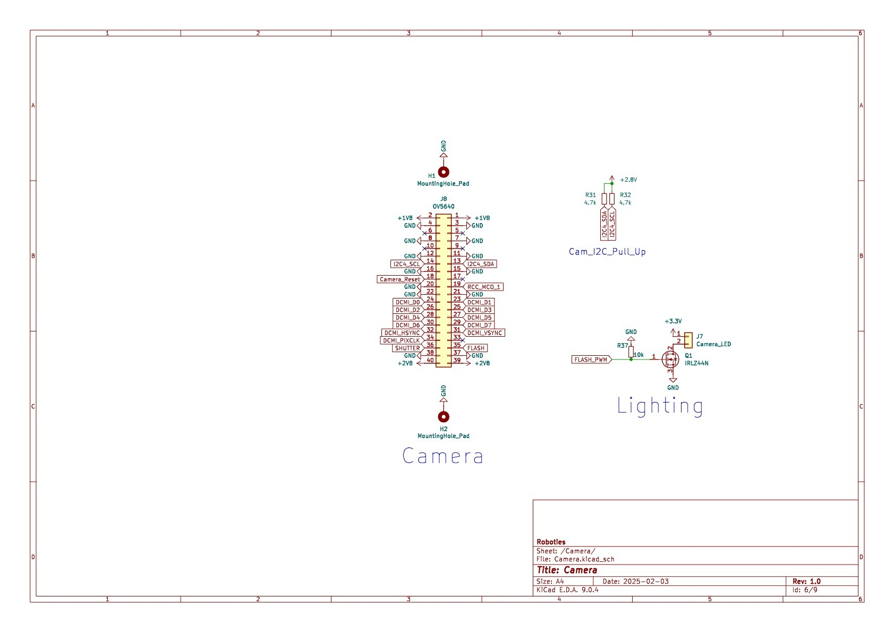
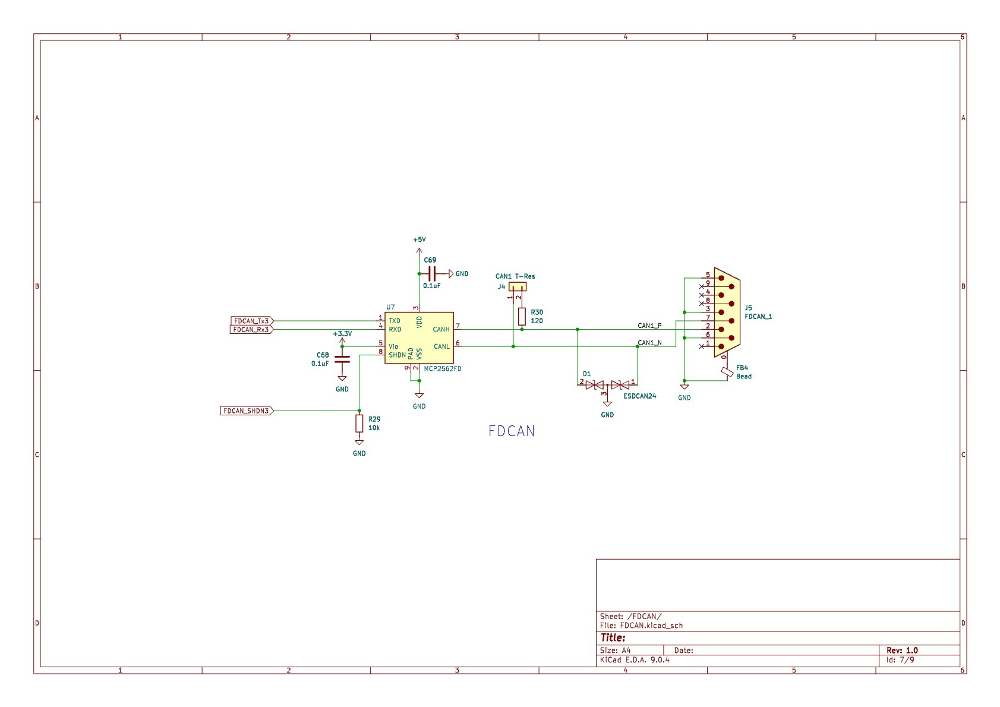
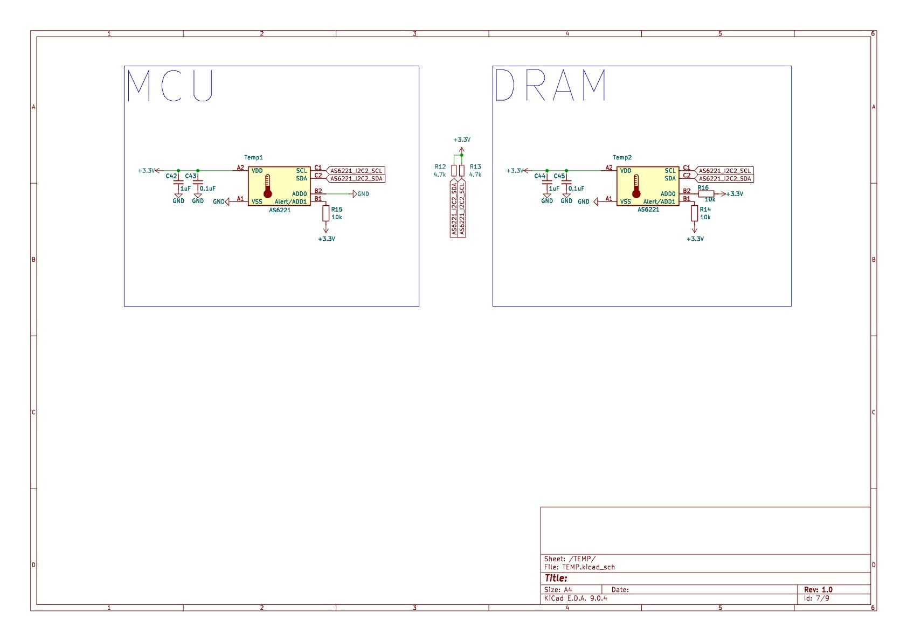
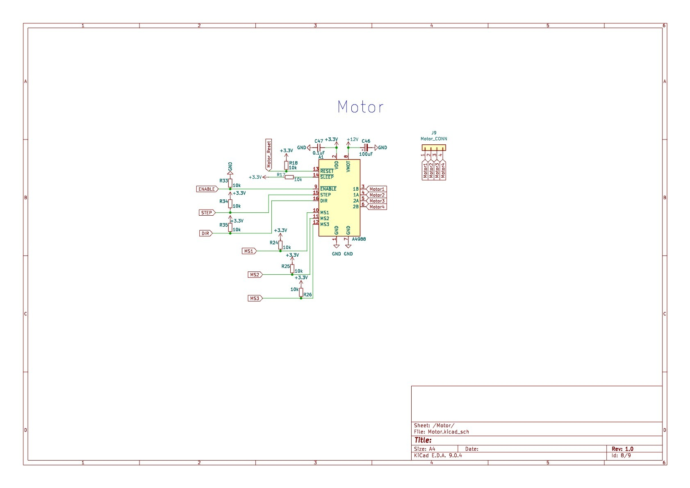
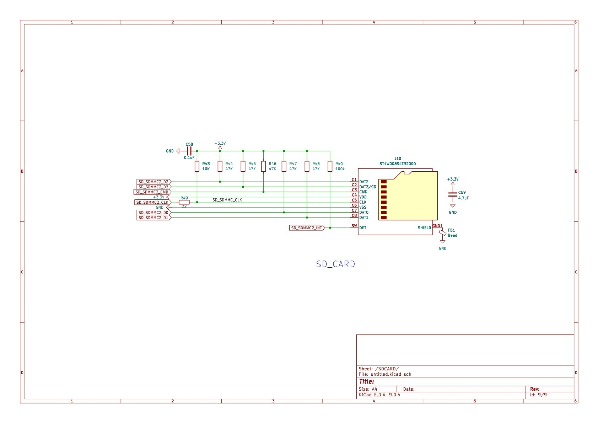

# Eye-Mass Hardware Design

## 🔎 Overview
The **Eye-Mass Board** is a custom embedded platform designed for **camera-based vision tasks and AI experimentation**.  
It integrates an OV5640 camera, external SDRAM, motor driver, and multiple debug/monitoring features.

---

## 📸 PCB Overview
| Top View | Bottom View |
|----------|-------------|
|  |  |

---

## 📑 Design Resources

- **Schematics**: [eye-mass.pdf](eye-mass.pdf) (PDF for quick view)
    
---

## 🔧 Key Hardware Notes
- **EDA Tool**: KiCad 7.0  
- **PCB Stackup**: 6-layer, impedance-controlled for high-speed (DCMI, FDCAN)  
- **Memory**: External SDRAM for real-time image buffering + AI workloads  
- **Camera**: OV5640 with DCMI interface for capturing and analysis  
- **Motor Driver**: Enables camera positioning to capture full target area  
- **Debugging**: LEDs + USART interface  
- **Monitoring**: Temperature and current/voltage sensing  

---

## 🧩 Schematic Highlights

## 🧩 Schematic Highlights (as-built)

### 1) MCU — STM32H723ZGTx

- **Connections**: Debug UART, **ST-Link Mini**, boot-mode pins, GPIO **PA~PG**, external clock **TCXO 12 MHz**, reset circuit.
- **Note**: Rich GPIO for peripherals; dedicated ports for debugging/boot.

### 2) SDRAM — IS42S16320F-7BL

- **Interface (FMC)**: DQ0–DQ15, A0–A12, BA0/BA1, SDNWE/SDNCAS/SDNRAS/SDNE0/SDCKE0/SDCLK, NBL0/NBL1.
- **Purpose**: Extends memory for buffering and AI execution.

### 3) Power

- **ICs**: **INA219BxD** (current/voltage monitor), **TPS562201** (buck).
- **Rails**: From **+12 V** → **+5 V, +3.3 V, +2.8 V, +1.8 V**.

### 4) Camera — OV5640

- **Interface**: **DCMI** D0–D7, HSYNC, VSYNC, PIXCLK + **I²C4**(SCL/SDA).
- **Power**: **+1.8 V / +2.8 V / +3.3 V**; LED control lines (Camera_LED / FLASH / FLASH_PWM).
- **Use**: Capture photos for **SMD counting inside a box**.

### 5) FDCAN

- **Transceiver**: **MCP2562FD**.
- **Connections**: MCU **FDCAN_Tx3 / FDCAN_Rx3** ↔ **CANH/CANL**; includes **120 Ω** termination.

### 6) Temperature — AS6221 ×2

- **Interface**: **I²C2** (SCL/SDA).
- **Use**: Monitor **motor driver temp** and **board temp** at two points.

### 7) Motor Driver — A4988

- **Signals**: **STEP, DIR, ENABLE, MS1, MS2, MS3**; outputs **1A/1B/2A/2B**.
- **Feature**: Microstepping configuration supported.

### 8) microSD — SDMMC2

- **Lines**: **D0–D3, CMD, CLK, INT**.
- **Use**: Storage for images/logs.

---

## ✅ Progress
- [x] Schematics completed  
- [x] PCB prototype (Rev. A) fabricated  
- [x] SDRAM bring-up (partial validation ongoing)  
- [ ] Camera interface bring-up (OV5640)  
- [x] Motor driver test & positioning control  
- [x] Communication tests (FDCAN / USART)  

---

## 📂 Folder Layout
