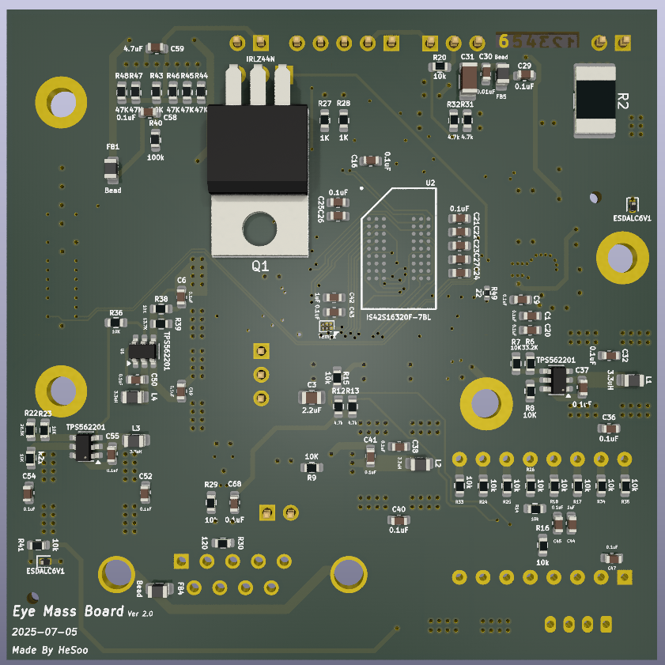
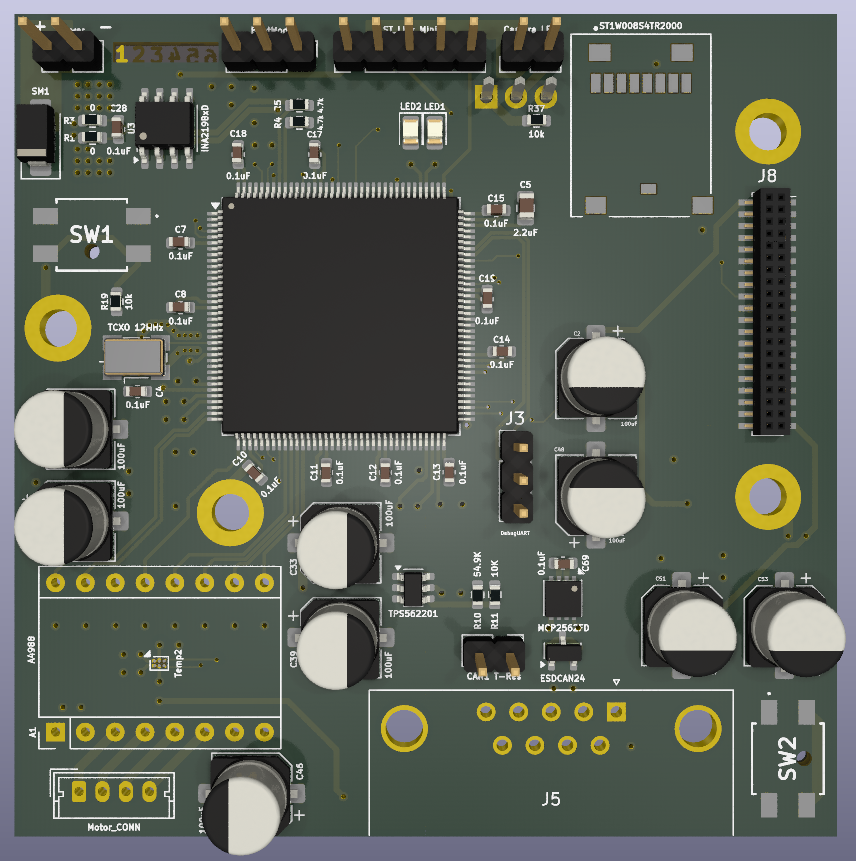

# Eye-Mass Hardware Design

The **Eye-Mass Board** is a custom embedded platform designed for **camera-based vision tasks and AI experimentation**.  
It integrates an OV5640 camera, external SDRAM, motor driver, and multiple debug/monitoring features.

---

## 📸 PCB Overview
| Top View | Bottom View |
|----------|-------------|
|  |  |

---

## 📑 Design Resources

- **Schematics**: [eye-mass.pdf](eye-mass.pdf) (PDF for quick view)  
- **PCB Layout**: [Download eye-mass.kicad_pcb](eye-mass.kicad_pcb) (Open in KiCad)
- **Gerber Files**: [eye-mass-gerber.zip](pcb/eye-mass-gerber.zip)
  
---

## 🔧 Key Hardware Notes
- **EDA Tool**: KiCad 7.0  
- **PCB Stackup**: 6-layer, impedance-controlled for high-speed (DCMI, FDCAN)  
- **Memory**: External SDRAM for real-time image buffering + AI workloads  
- **Camera**: OV5640 with DCMI interface for capturing and analysis  
- **Motor Driver**: Enables camera positioning to capture full target area  
- **Debugging**: LEDs + USART interface  
- **Monitoring**: Temperature and current/voltage sensing  

---

## ✅ Progress
- [x] Schematics completed  
- [x] PCB prototype (Rev. A) fabricated  
- [ ] SDRAM bring-up (partial validation ongoing)  
- [ ] Camera interface bring-up (OV5640)  
- [ ] Motor driver test & positioning control  
- [ ] Communication tests (FDCAN / USART)  

---

## 📂 Folder Layout
