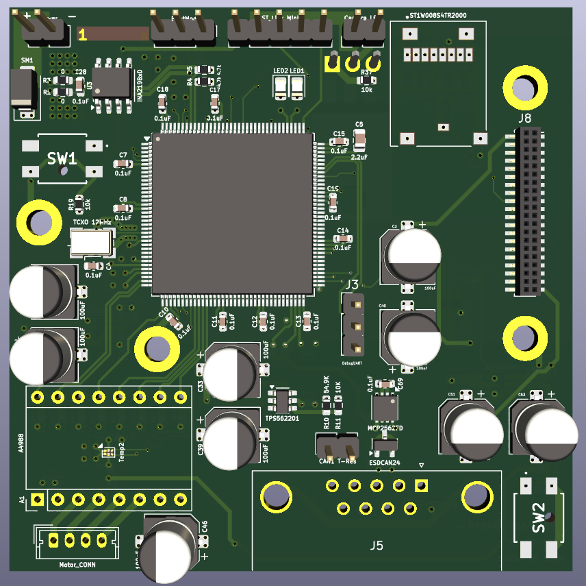
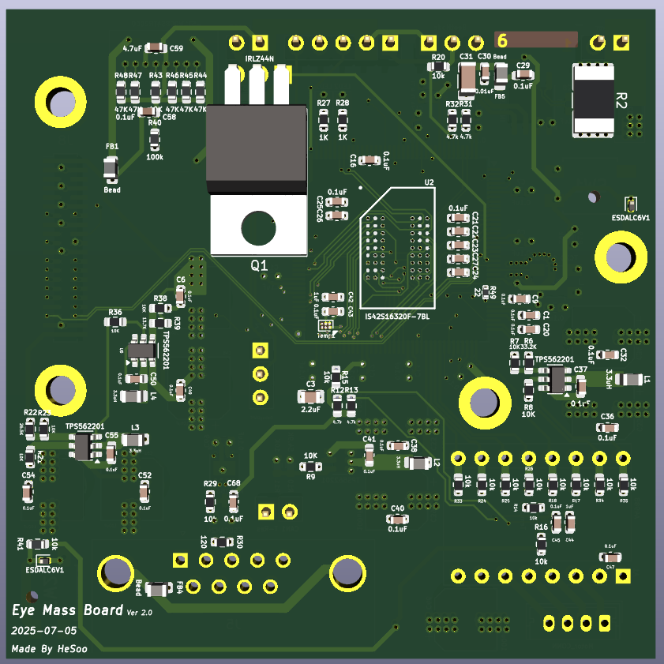

# Eye-Mass Board  
*Embedded Vision Processing Hardware Platform*

---

## 🔎 Overview
**Eye-Mass** is a custom embedded hardware board designed for **real-time image processing and AI experimentation**.  
It integrates a camera (OV5640), external SDRAM, motor control, and communication interfaces to enable tasks such as **capturing and analyzing images of components inside a box**.

---

## 🔧 Hardware Features

| Component               | Purpose                                                                 |
|-------------------------|-------------------------------------------------------------------------|
| **Debug LED**           | Visual feedback for board status and firmware debugging                 |
| **SDRAM**               | Additional memory for buffering image data and running lightweight AI   |
| **OV5640 Camera**       | Captures images (e.g., counting SMD components inside a box)            |
| **Motor Driver**        | Moves the camera to capture the entire box view                         |
| **FDCAN**               | High-speed, reliable communication with external modules                |
| **USART**               | Serial interface for debugging and logging                              |
| **Temperature Sensor**  | Monitors motor driver and board ambient temperature                     |
| **Current/Voltage Monitor** | Measures system power consumption and provides protection           |

---

## 📸 Hardware Overview
| PCB Top | PCB Bottom |
|---------|------------|
|  |  |

---

## ✅ Current Status
- [x] Schematic design completed
- [x] PCB prototype (Rev. A) fabricated
- [x] SDRAM bring-up and validation
- [ ] Camera interface bring-up (OV5640)
- [x] Motor control & positioning test
- [x] Communication test (FDCAN, USART)
- [ ] Firmware integration (image capture + AI experimentation)

---

## 📑 References
- [STM32H7 Reference Manual](https://www.st.com/resource/en/reference_manual/dm00314099.pdf)  
- [OV5640 Camera Datasheet](https://www.arducam.com/downloads/datasheet/OV5640DS.pdf)
