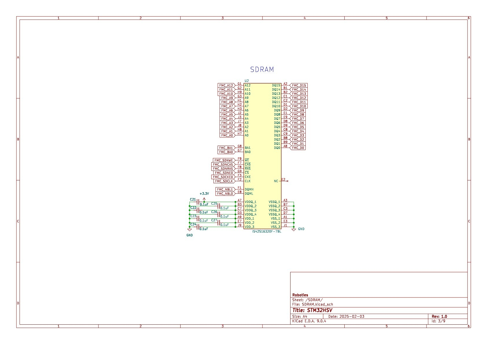

## 📑 Table of Contents
1. [MCU](#1-mcu)
2. [SDRAM](#2-sdram)
3. [Power](#3-power)
4. [Camera](#4-camera)
5. [FDCAN](#5-fdcan)
6. [Temperature Sensor](#6-temperature-sensor)
7. [Motor Driver](#7-motor-driver)
8. [SD Card](#8-sd-card)
9. [Conclusion](#9-conclusion)

---

## 1. MCU

- **Model**: STM32H723ZGTx  
- **Key Connections**:  
  - Debug UART (J3)  
  - ST-Link Mini (J2)  
  - Boot mode selector (J6)  
  - Reset circuit (SW1, SW2, NRST)  
  - External TCXO 12 MHz (Y1)  
- **GPIOs**: All major ports (PA, PB, PC, PD, PE, PF, PG, PH) broken out for peripheral interfacing.  
- **Features**: Provides high-performance ARM Cortex-M7 core, suitable for real-time and multimedia applications.

---

## 2. SDRAM

- **Chip**: IS42S16320F-7BL (16-bit wide SDRAM)  
- **Interface**: Connected via FMC (Flexible Memory Controller)  
- **Signals**: Data (DQ0–DQ15), Address (A0–A12), Bank Address (BA0–1), Control (SDNWE, SDNCAS, SDNRAS, SDCLK, SDCKE0, NBL0–1).  
- **Purpose**: Expands available memory for buffering camera/video data and high-speed computations.  

---

## 3. Power
- **ICs**:  
  - **TPS562201** – Multiple buck converters generating +5V, +3.3V, +2.8V, +1.8V  
  - **INA219BxD** – Current/voltage monitoring over I2C  
- **Input**: +12V  
- **Output Rails**: +5V, +3.3V, +2.8V, +1.8V  
- **Features**:  
  - Power monitoring with shunt resistor (R2 = 0.1Ω)  
  - Multiple decoupling capacitors for stability  

---

## 4. Camera
- **Module**: OV5640 (5MP CMOS sensor)  
- **Interface**:  
  - DCMI (D0–D7, HSYNC, VSYNC, PIXCLK)  
  - I2C4 (SDA, SCL) for configuration  
- **Power Rails**: +1.8V, +2.8V, +3.3V  
- **Other Signals**:  
  - Camera reset, shutter control  
  - LED & Flash control (Camera_LED, FLASH, FLASH_PWM)  

---

## 5. FDCAN
- **Transceiver**: MCP2562FD  
- **Connections**:  
  - MCU pins: FDCAN_Tx3, FDCAN_Rx3  
  - Bus lines: CANH, CANL  
- **Features**:  
  - 120Ω termination resistor (R30)  
  - ESD protection diode (ESDCAN24)  
  - Shutdown control (FDCAN_SHDN3)  

---

## 6. Temperature Sensor
- **IC**: AS6221 (x2)  
- **Interface**: I2C2 (SCL, SDA)  
- **Additional Features**: Address pins (ADD0/ADD1) allow multiple sensors on the same bus.  
- **Purpose**: Provides ambient and board-level temperature monitoring.  

---

## 7. Motor Driver
- **Driver**: A4988 (Stepper motor driver)  
- **Signals**: STEP, DIR, ENABLE, RESET, SLEEP, MS1–MS3 (microstepping config).  
- **Outputs**: 1A, 1B, 2A, 2B → Stepper motor coils  
- **Features**:  
  - Supports microstepping  
  - Powered from +12V motor supply with logic at +3.3V  

---

## 8. SD Card
- **Connector**: ST1W008S4TR2000 microSD slot  
- **Interface**: SDMMC2 (D0–D3, CMD, CLK, INT)  
- **Power**: +3.3V with filtering (FB1 bead, decoupling capacitors).  
- **Features**: Supports standard SD card data logging.  

---

## 9. Conclusion
This STM32H7 board design integrates:  
- High-performance MCU  
- External SDRAM for data buffering  
- Rich peripheral set: Camera, CAN, SD card, stepper motor, temperature sensors  
- Robust power management and monitoring  

**Application Domain**: Robotics, computer vision, satellite payload prototyping, or multi-sensor embedded systems.  

---
